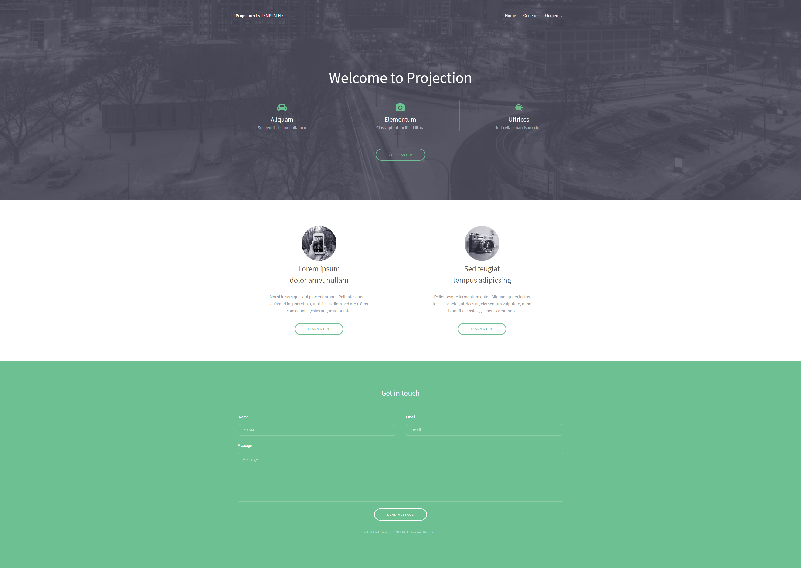

# sample page 4

an image-to-HTML/CSS coding

## live preview

[on github pages]()

## notes

- this work is a try to make sample image of website into code in HTML/CSS and a little bit of JavaScript. without any framework.
- is it RESPONSIVE.
- icons and few images are not the exact same but the overall page still similer to the original image.
- I have used: HTML, CSS (with flexbox and media queries), font awsome icons and JavaScript.

## the original image

